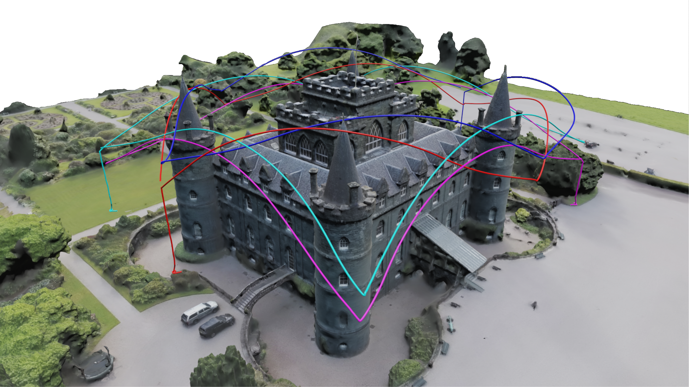
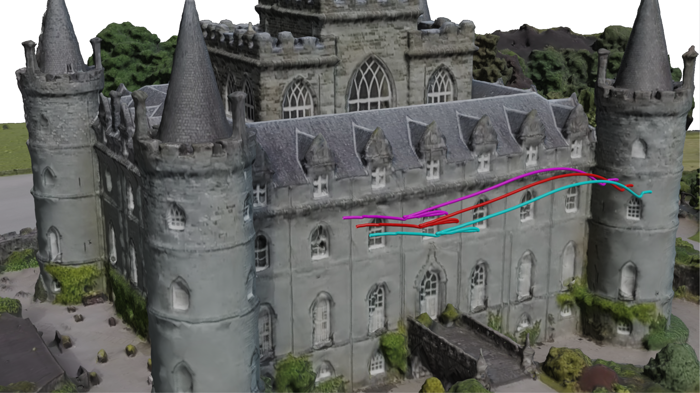
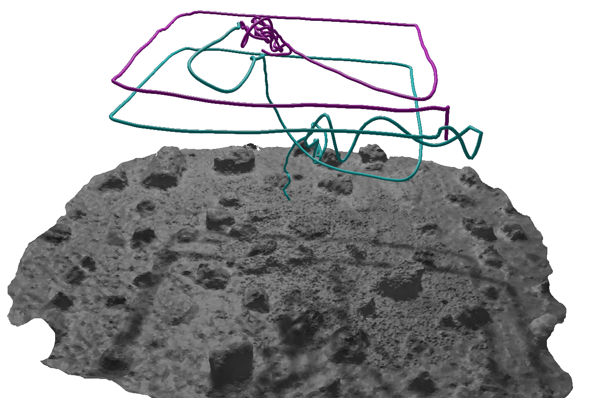

<a name="readme-top"></a>

[![Contributors][contributors-shield]][contributors-url]
[![Forks][forks-shield]][forks-url]
[![Stargazers][stars-shield]][stars-url]
[![Issues][issues-shield]][issues-url]
[![Apache 2.0 License][license-shield]][license-url]

<!-- PROJECT LOGO -->
<br />
<div align="center">
  <a href="https://github.com/jpl-x/x_multi_agent">
    
  </a>

<h2 align="center">The X Library</h2>

  <p align="center">
A generic C++ library for single and multi system vision-based navigation, with multi-sensor fusion capabilities for thermal, range, solar and inertial measurements.
    <br />
    <a href="https://rpg.ifi.uzh.ch/xctio.html">Webpage</a>
    ·
    <a href="https://github.com/jpl-x/x_multi_agent/issues">Report Bug</a>
    ·
    <a href="https://github.com/jpl-x/x_multi_agent/issues">Request Feature</a>
  </p>
</div>


<!-- TABLE OF CONTENTS -->
<details>
  <summary>Table of Contents</summary>
  <ol>
    <li>
      <a href="#about">About</a>
    </li>
    <li>
      <a href="#abstract">Abstract</a>
    </li>
    <li><a href="#structure">Structure</a></li>
    <li><a href="#usage">Usage</a></li>
        <ul><a href="#requirements">Requirements</a></ul>
        <ul><a href="#installation">Installation</a></ul>
        <ul><a href="#docker">Docker</a></ul>
        <ul><a href="#interface">Interface</a></ul>
        <ul><a href="#working-with-ground-truth">Working with ground truth</a></ul>
        <ul><a href="#demo">Demo</a></ul>
    <li><a href="datasets">Datasets</a></li>
    <li><a href="#license">License</a></li>
    <li><a href="#acknowledgments">Acknowledgments</a></li>
  </ol>
</details>

## About

<div align="center">
  <a href="https://github.com/jpl-x/x_multi_agent">
    
  </a>
</div>

This is the code for the paper **Data-Efficient Collaborative Decentralized Thermal-Inertial Odometry**
([PDF](https://rpg.ifi.uzh.ch/docs/RAL22_Polizzi.pdf)) by [Vincenzo Polizzi](https://github.com/viciopoli01/)
, [Robert Hewitt](https://github.com/neorobo), [Javier Hidalgo-Carrió](https://github.com/jhidalgocarrio)
, [Jeff Delaune](https://github.com/jeff-delaune) and [Davide Scaramuzza](http://rpg.ifi.uzh.ch/people_scaramuzza.html).
For an overview of our method, check out our [webpage](https://rpg.ifi.uzh.ch/xctio.html).

If you use any of this code, please cite the following publication:

```bibtex
@ARTICLE{Polizzi22RAL,
  author={Polizzi, Vincenzo and Hewitt, Robert and Hidalgo-Carrió, Javier and Delaune, Jeff and Scaramuzza, Davide},
  journal={IEEE Robotics and Automation Letters},   
  title={Data-Efficient Collaborative Decentralized Thermal-Inertial Odometry},   
  year={2022},  
  volume={7},  
  number={4},  
  pages={10681-10688},  
  doi={10.1109/LRA.2022.3194675}
}
```

## Abstract

We propose a system solution to achieve dataefficient, decentralized state estimation for a team of flying
robots using thermal images and inertial measurements. Each
robot can fly independently, and exchange data when possible
to refine its state estimate. Our system front-end applies an
online photometric calibration to refine the thermal images so as
to enhance feature tracking and place recognition. Our system
back-end uses a covariance-intersection fusion strategy to neglect
the cross-correlation between agents so as to lower memory
usage and computational cost. The communication pipeline uses
Vector of Locally Aggregated Descriptors (VLAD) to construct a
request-response policy that requires low bandwidth usage. We
test our collaborative method on both synthetic and real-world
data. Our results show that the proposed method improves by
up to 46 % trajectory estimation with respect to an individualagent approach, while reducing up to 89 % the
communication
exchange. Datasets and code are released to the public, extending
the already-public JPL xVIO library.

<p align="right">(<a href="#readme-top">back to top</a>)</p>

## Structure

- `include`: contains all the header files for the library
- `src`: contains all the declaration of the classes in the headers
- `third_party`: contains a modified version of [DBoW3](https://github.com/rmsalinas/DBow3) that builds with c++17
- `Vocabulary`: contains a vocabulary of visual words trained with thermal data `thermal_voc_3_4_dbow3_calib.yaml`

<p align="right">(<a href="#readme-top">back to top</a>)</p>

## Usage

This code was tested on `Ubuntu 20.04` using `ROS Noetic`, compiled with `g++-10` (`sudo apt-get install g++-10`).

### Requirements

The following libraries are needed for installing the x library with the thermal collaborative feature:

- [OpenCV 3.3.1 or higher](https://docs.opencv.org/4.4.0/d7/d9f/tutorial_linux_install.html)
- [Ceres Solver](http://ceres-solver.org/installation.html)
- [NLopt](https://nlopt.readthedocs.io/en/latest/NLopt_Installation/)

<p align="right">(<a href="#readme-top">back to top</a>)</p>

### Installation

To install the x library you can download the .deb package for your architecture here, or build it by yourself by doing:

```bash
$ git clone git@github.com:jpl-x/x_multi_agent.git
$ mkdir build && cd build
$ cmake ..
$ make package
$ sudo dpkg -i x_1.2.4_$(dpkg --print-architecture).deb
```

To enable/disable some features of the collaborative approach, set to ON/OFF the CMake options:

- `PHOTOMETRIC_CALI`: if `ON` enables the request-response communication pipeline
- `MULTI_UAV`: if `ON` enables the collaborative setup
- `REQUEST_COMM`: if `ON` enables the request-response communication pipeline
- `GT_DEBUG`: if `ON` the library expects to receive matches with the keypoints 3D ground-truth (
  see [working with ground truth](#working-with-ground-truth)).

When all the tags are `OFF` the system's configuration is back to the [xVIO](https://github.com/jeff-delaune/x).

<p align="right">(<a href="#readme-top">back to top</a>)</p>

### Docker

Make sure to have installed Docker, you don't need any other dependency here!
To build a Docker image containing the library with the different configurations setting to true the following flags:

- `PHOTOMETRIC_CALI`: if `true` enables the photometric calibration algorithm on the incoming images
- `MULTI_UAV`: if `true` enables the collaborative setup
- `REQUEST_COMM`: if `true` enables the request-response communication pipeline

Run the following command to build the image:

```bash
docker build -t x-image:x-amd64 --build-arg PHOTOMETRIC_CALI=true --build-arg MULTI_UAV=true --build-arg REQUEST_COMM=true .
```

<p align="right">(<a href="#readme-top">back to top</a>)</p>

### Interface

The x Library accepts as input various sensors' measurements, that are then fused together in the IEKF.
To use the library in your project add in your `CMakeLists.txt`:

```Cmake
find_package(x 1.2.3 REQUIRED)

# ...

include_directories(
        OTHER_INCLUDES
        ${x_INCLUDE_DIRS}
)

# ...

target_link_libraries(${PROJECT_NAME}
        OTHER_LIBRARIES
        ${x_LIBRARIES}
        )
```

Usage example:

- Initialization

```c++
#include <x/vio.h>
#include <ctime>

VIO vio;

const auto params = vio.loadParamsFromYaml("PATH_TO_A_YAML_FILE");

vio.setUp(params);

time_t now = time(0);
vio_.initAtTime((double)now);
```

Feed the filter with sensors' data. All the sensors reading can be performed in different threads.

- Sun sensor

```c++
// Sun sensor
SunAngleMeasurement angle;
angle.timestamp = YOUR_DATA;
angle.x_angle = YOUR_DATA;
angle.y_angle = YOUR_DATA;

vio_.setLastSunAngleMeasurement(angle);
```

- Range sensor

```c++
RangeMeasurement range;
range.timestamp = YOUR_DATA;
range.range = YOUR_DATA;

vio_.setLastRangeMeasurement(range);
```

- IMU

```c++
double timestamp = YOUR_DATA;
int seq = YOUR_DATA;
Vector3 w_m(YOUR_DATA);
Vector3 a_m(YOUR_DATA);
const auto propagated_state = vio_.processImu(timestamp, seq, w_m, a_m);
```

- Images

```c++
double timestamp = YOUR_DATA;;
int seq = YOUR_DATA;
auto match_img = TiledImage(YOUR_DATA);
ato feature_img = TiledImage(match_img);

const auto updated_state = vio_.processImageMeasurement(timestamp, seq, match_img, feature_img);
```

Refer to the demo as an example of usage with ROS.

<p align="right">(<a href="#readme-top">back to top</a>)</p>

### Working with ground truth

When the CMake option `GT_DEBUG` is `ON`, the library expects to [receive](src/x/vio/vio.cpp#L270) matches with the 3D
keypoints information.
The format of the matches is a `vector` of `floats`, and the structure is the following:

```
9N match vector structure:

0: cam_id
1: time_prev in seconds
2: x_dist_prev
3: y_dist_prev
4: time_curr
5: x_dist_curr
6: x_dist_curr
7,8,9: 3D coordinate of feature
```

### Demo

To run the demo refer to the [ROS wrapper](https://github.com/jpl-x/x_multi_agent_ros).

<p align="right">(<a href="#readme-top">back to top</a>)</p>

## Datasets

Datasets to test our system are available [here](https://rpg.ifi.uzh.ch/xctio.html).

We provide visual data in the Inveraray Castle around and Inveraray Castle parallel.
The former contains four drones flying trajectories around the castle. The latter has three drones performing parallel
trajectories in front of the castle, including the landmarks' ground truth. Namely, it contains 3D points
visible from the three UAVs.
<p align="center">
<a href=""></a> <a href=""></a>
</p>

We also provide the real data dataset with thermal data of two drones flying squared trajectories on the MarsYard.

<p align="center">
<a href=""></a>
</p>

<p align="right">(<a href="#readme-top">back to top</a>)</p>

## License

    Copyright (c) 2022-23 California Institute of Technology (“Caltech”). U.S. Government
    sponsorship acknowledged.

    All rights reserved.

    Redistribution and use in source and binary forms, with or without modification, are permitted provided
    that the following conditions are met:
        • Redistributions of source code must retain the above copyright notice, this list of conditions and
    the following disclaimer.
        • Redistributions in binary form must reproduce the above copyright notice, this list of conditions
    and the following disclaimer in the documentation and/or other materials provided with the
    distribution.
        • Neither the name of Caltech nor its operating division, the Jet Propulsion Laboratory, nor the
    names of its contributors may be used to endorse or promote products derived from this software
    without specific prior written permission.

    THIS SOFTWARE IS PROVIDED BY THE COPYRIGHT HOLDERS AND CONTRIBUTORS "AS
    IS" AND ANY EXPRESS OR IMPLIED WARRANTIES, INCLUDING, BUT NOT LIMITED TO,
    THE IMPLIED WARRANTIES OF MERCHANTABILITY AND FITNESS FOR A PARTICULAR
    PURPOSE ARE DISCLAIMED. IN NO EVENT SHALL THE COPYRIGHT OWNER OR
    CONTRIBUTORS BE LIABLE FOR ANY DIRECT, INDIRECT, INCIDENTAL, SPECIAL,
    EXEMPLARY, OR CONSEQUENTIAL DAMAGES (INCLUDING, BUT NOT LIMITED TO,
    PROCUREMENT OF SUBSTITUTE GOODS OR SERVICES; LOSS OF USE, DATA, OR PROFITS;
    OR BUSINESS INTERRUPTION) HOWEVER CAUSED AND ON ANY THEORY OF LIABILITY,
    WHETHER IN CONTRACT, STRICT LIABILITY, OR TORT (INCLUDING NEGLIGENCE OR
    OTHERWISE) ARISING IN ANY WAY OUT OF THE USE OF THIS SOFTWARE, EVEN IF
    ADVISED OF THE POSSIBILITY OF SUCH DAMAGE.

Distributed under the Apache 2.0 License. See [LICENSE](LICENSE) for more information.

<p align="right">(<a href="#readme-top">back to top</a>)</p>

## Acknowledgments

    The research was funded by the Combat Capabilities Development Command Soldier
    Center and Army Research Laboratory. This research was carried out at the Jet 
    Propulsion Laboratory, California Institute of Technology, and was sponsored 
    by the JPL Visiting Student Research Program (JVSRP) and the National 
    Aeronautics and Space Administration (80NM0018D0004).

A particular thanks goes also to [Manash Patrim Das](https://www.linkedin.com/in/manshpratim/) for opensourcing his code
about
the [online photometric calibration](https://github.com/mpdmanash/thermal_photometric_calibration).

The 3D reconstruction of the [Inveraray Castle](https://skfb.ly/6z7Rr) by Andrea Spognetta (Spogna) is licensed
under [Creative Commons Attribution-NonCommercial](http://creativecommons.org/licenses/by-nc/4.0/).

Readme template layout from [Best-README-Template](https://github.com/othneildrew/Best-README-Template).
<p align="right">(<a href="#readme-top">back to top</a>)</p>


[contributors-shield]: https://img.shields.io/github/contributors/jpl-x/x_multi_agent.svg?style=for-the-badge

[contributors-url]: https://github.com/jpl-x/x_multi_agent/graphs/contributors

[forks-shield]: https://img.shields.io/github/forks/jpl-x/x_multi_agent.svg?style=for-the-badge

[forks-url]: https://github.com/jpl-x/x_multi_agent/network/members

[stars-shield]: https://img.shields.io/github/stars/jpl-x/x_multi_agent.svg?style=for-the-badge

[stars-url]: https://github.com/jpl-x/x_multi_agent/stargazers

[issues-shield]: https://img.shields.io/github/issues/jpl-x/x_multi_agent.svg?style=for-the-badge

[issues-url]: https://github.com/jpl-x/x_multi_agent/issues

[license-shield]: https://img.shields.io/github/license/jpl-x/x_multi_agent.svg?style=for-the-badge

[license-url]: https://github.com/viciopoli01/jpl-x/tree/build_and_play/LICENSE

[product-screenshot]: images/demo.gif
